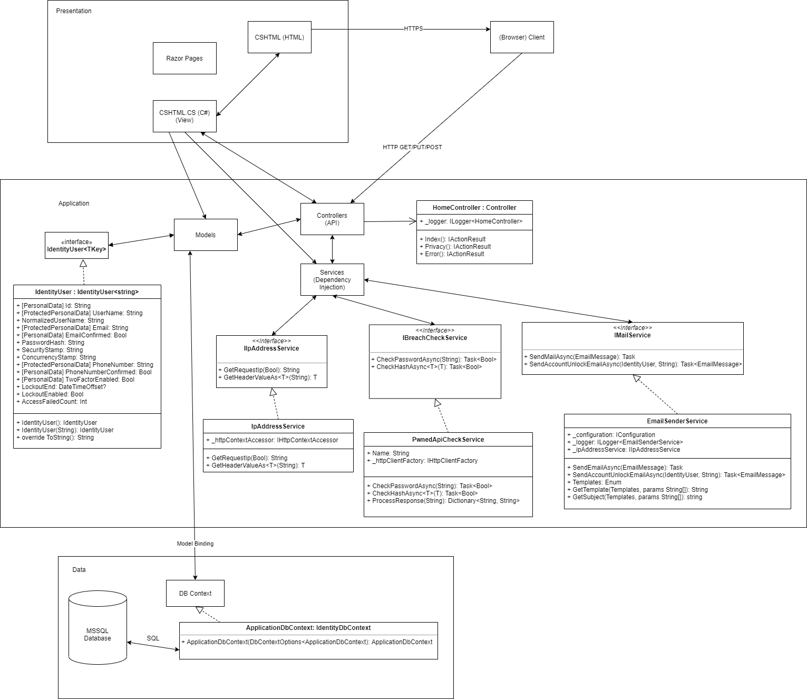

# SecureWebApp

# Introduction

SecureWebApp - Secure Web Application Template for ASP.NET Core 5.0

A programming project for course COMP.SEC.300 Secure Programming, Spring 2021

The repository contains all the source code, architecture diagram and documentation for the project.

# Documentation

Project Documentation available in Documentation.pdf in project root.

Direct link to the project documentation [HERE](./Documentation.pdf).

# Architecture

The rough architecture diagram of the application below:

Link to the full picture [here](./Architecture.png).

# Local development environment setup

- Clone the repository
- Install Visual Studio 2019 (Professional/Enterprise recommended)
- Install required tools (ASP.NET Core Web development tools, MSSQL
- Optionally, install Microsoft SQL Server 2019 separately
- Open the project (solution file) SecureWebApp.sln in VS
- Create the database and run the database migrations by running
  dotnet tool install --global dotnet-ef
  dotnet add package Microsoft.EntityFrameworkCore.Design
  dotnet ef migrations add InitialCreate
  dotnet ef database update
- Build/Debug/Launch the project locally
- Open in browser: http://localhost:5000 (INSECURE, NOT RECOMMENDED) or https://localhost:5001

# Recommended tools and libraries for Windows development

- Visual Studio 2019 Pro (all .NET 5.0 workloads)
- ASP.NET Core 5.0 (MVC)
- Microsoft SQL Server 2019 (LocalDB for testing available, integrated in Visual Studio)  
- Nuget Package Manager
- Required nuget packages included in the project configs
- Git Bash for Windows
- Google Chrome / Mozilla Firefox

# Continous Integration and Deployment

On pushes or Pull Requests to main branch, a build-test job is triggered to build the project in cloud runner and run all the unit tests and ensure they pass.
After a successful test run, the deployment job is run to publish the in a private server.

The application is available for live testing in https://securewebapp.peltonet.com/

# Static Analysis

The project source code is analyzed using SonarQube Cloud (SonarCloud) service.

SonarCloud is integrated through GitHub Actions.

The URL for the project analysis: https://sonarcloud.io/dashboard?id=Sinipelto_securewebapp
